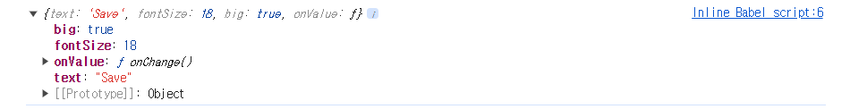

# Props

## Props, memo, PropTypes

```HTML
<!DOCTYPE html>
<html lang="en">

<head>
  <meta charset="UTF-8">
  <meta name="viewport" content="width=device-width, initial-scale=1.0">
  <title>Props</title>
</head>

<body>
  <div id="root"></div>
</body>
<script crossorigin src="https://unpkg.com/react@18/umd/react.development.js"></script>
<script crossorigin src="https://unpkg.com/react-dom@18/umd/react-dom.development.js"></script>
<!-- PropTypes -->
<script src="https://unpkg.com/prop-types@15.7.2/prop-types.js"></script>
<script src="https://unpkg.com/@babel/standalone/babel.min.js"></script>
<script type="text/babel">

  // Componenet 안에 Component를 넣을 수 있다.
  // Props는 부모 컴포넌트에서 자식 컴포넌트로 값을 넘겨 줄 때 자식 컴포넌트에서 받은 매개변수를 Props라고 부른다.
  // fontSize를 작성하지 않았을 경우, `fontSize = 15`와 같이 기본값을 지정해 줄 수 있다.
  function Btn({ value, changeValue, fontSize = 15 }) {
    console.log(value, "was rendered")
    return (
      <button
        onClick={changeValue}
        style={{
          backgroundColor: "yellow",
          borderRadius: 10,
          padding: "10px 20px",
          margin: "0px 10px",
          fontSize
        }}
      >
        {value}
      </button>
    )
  }

  // React.memo()를 사용하는 이유는 부모 컴포넌트에서 값을 넘겨줘서 값이 변경 될 때 변경되지 않아도 되는 부분을 다시 호출하지 않도록 하기 위해서 사용하는 것이다.
  const MemorizedBtn = React.memo(Btn);

  // PropTypes로 타입을 지정해 주면 타입이 맞지 않을 경우에, 콘솔에 에러메세지가 뜬다.
  // isRequired = 필수적으로 작성.
  Btn.propTypes = {
    value: PropTypes.string.isRequired,
    fontSize: PropTypes.number
  }

  function App() {
    // React.useState() = state
    const [text, setText] = React.useState("Save Changes");
    const changeText = () => setText((current) => current === "Save Changes" ? "Revert Changes" : "Save Changes");

    return (
      <div>
        <MemorizedBtn value={text} fontSize={18} changeValue={changeText} />
        <MemorizedBtn value={"Continue"} />
      </div>
    )
  }

  const root = document.getElementById('root');
  ReactDOM.render(<App />, root);

</script>

</html>
```

[ PropTypes 링크 ] [PropTypes](https://legacy.reactjs.org/docs/typechecking-with-proptypes.html)

<br>

### Props(2)

```HTML
<!DOCTYPE html>
<html lang="en">

<head>
  <meta charset="UTF-8">
  <meta name="viewport" content="width=device-width, initial-scale=1.0">
  <title>Props</title>
</head>

<body>
  <div id="root"></div>
</body>
<script crossorigin src="https://unpkg.com/react@18/umd/react.development.js"></script>
<script crossorigin src="https://unpkg.com/react-dom@18/umd/react-dom.development.js"></script>
<script src="https://unpkg.com/prop-types@15.7.2/prop-types.js"></script>
<script src="https://unpkg.com/@babel/standalone/babel.min.js"></script>
<script type="text/babel">

  // { value, changeValue, fontSize}가 아닌 props Object로도 값을 받을 수 있다.
  function Btn(props) {

    console.log(props)

    return <button
      style={{
        backgroundColor: "blue",
        border: 0,
        padding: props.big ? "10px 20px" : "10px",
        margin: "5px",
        borderRadius: 5,
        color: "white",
        fontSize: props.fontSize
      }}
      onClick={props.onValue}
    >
      {props.text}
    </button>
  }

  // PropTypes : Btn 컴포넌트가 어떤 prop들을 받는지 검사하는 게 가능.
  Btn.propTypes = {
    text: PropTypes.string.isRequired,
    fontSize: PropTypes.number
  }

  const MemorizedBtn = React.memo(Btn);

  function App() {

    const [value, setValue] = React.useState("Save");

    const onChange = () => setValue((current) => current === "Save" ? "Revert" : "Save")

    return (
      <div>
        <MemorizedBtn text={value} onValue={onChange} fontSize={18} big={true} />
        <MemorizedBtn text={"change"} />
      </div>
    )
  }

  const root = document.getElementById('root');
  ReactDOM.render(<App />, root);

</script>

</html>
```

- console.log(props)


