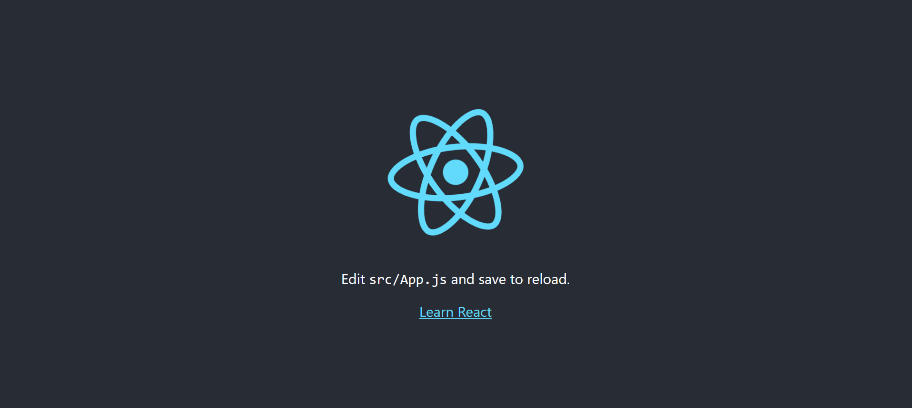

# create-react-app

[Create-react-app : Getting Started ](https://create-react-app.dev/docs/getting-started/)

- create-react-app을 실행하기 전 - Node.js 설치

  ```
  <!-- node.js 설치 확인 -->
  PS C:\Users\human\TIL> node -v
  v20.17.0

  <!-- npx command를 작동할 수 있다면 준비 완료 -->
  PS C:\Users\human\TIL> npx

  Entering npm script environment at location:
  C:\Users\human\TIL
  Type 'exit' or ^D when finished

  Microsoft Windows [Version 10.0.22631.4037]
  (c) Microsoft Corporation. All rights reserved.

  C:\Users\human\TIL>exit
  ```

- create-react-app 시작

  ```
  npx create-react-app react-for-beginners
  cd react-for-beginners
  npm start
  ```

- my-app 폴더구조

  ```
    my-app
      |------- node_modules
      |------- public
      |------- src (모든 파일을 넣을 폴더)
                  |------ App.js
                  |------ index.js
                  |------ style.css
      |------- .gitignore
      |------- package-lock.json
      |------- package.json
      |------- README.md
  ```

  - 리액트 실행

  ```
  npm start
  ```

  
  
  <br>

- 애플리케이션을 깔끔하게 정리
  - src폴더 안에 App.js, index.js만 남기고 삭제

<br>

- Example

  ```js
  // Button.js

  function Button({ text }) {
    return <button>{text}</button>;
  }

  export default Button;
  ```

  ```js
  // App.js

  // import를 했으면 반드시 사용을 해야한다.
  import Button from "./Button";

  function App() {
    return (
      <div>
        <h1>Welcome back!</h1>
        <Button text={"Continue"} />
      </div>
    );
  }

  export default App;
  ```

  ```js
  // index.js

  import React from "react";
  import ReactDOM from "react-dom";
  import App from "./App";

  ReactDOM.render(
    <React.StrictMode>
      <App />
    </React.StrictMode>,
    document.getElementById("root")
  );
  ```

  

  <br>

- propTypes 적용

  ```js
  npm i prop-types
  ```

  ```js
  // Button.js

  // PropTypes import
  import PropTypes from "prop-types";

  function Button({ text }) {
    return <button>{text}</button>;
  }

  // PropTypes 작성
  Button.prototype = {
    text: PropTypes.string.isRequired,
  };

  export default Button;
  ```

  <br>

- CSS 작성 방식 1 : 전역 (모두 동일하게 적용)

  ```css
  /* style.css */

  button {
    background-color: tomato;
    color: white;
  }
  ```

  ```js
  // index.js

  import React from "react";
  import ReactDOM from "react-dom";
  import App from "./App";
  // 렌더링하는 파일에 style.css import
  import "./style.css";

  ReactDOM.render(
    <React.StrictMode>
      <App />
    </React.StrictMode>,
    document.getElementById("root")
  );
  ```

- CSS 작성 방식 2 : 개별로 적용 (.module.css)

  ```css
  /* Button.module.css */

  .btn {
    background-color: tomato;
    color: white;
  }
  ```

  ```js
  // Button.js

  import PropTypes from "prop-types";
  // Button.module.css import
  import styles from "./Button.module.css";

  function Button({ text }) {
    // className에 import한 css 요소 가져오기
    return <button className={styles.btn}>{text}</button>;
  }

  Button.prototype = {
    text: PropTypes.string.isRequired,
  };

  export default Button;
  ```

  ```css
  /* App.module.css */

  .title {
    font-family: "Courier New", Courier, monospace;
    font-size: 18px;
  }
  ```

  ```js
  // App.js

  import Button from "./Button";
  // App.module.css import
  import styles from "./App.module.css";

  function App() {
    return (
      <div>
        // className에 css 클래스명 가져옴
        <h1 className={styles.title}>Welcome back!</h1>
        <Button text={"Continue"} />
      </div>
    );
  }

  export default App;
  ```
