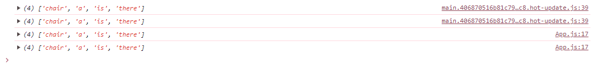
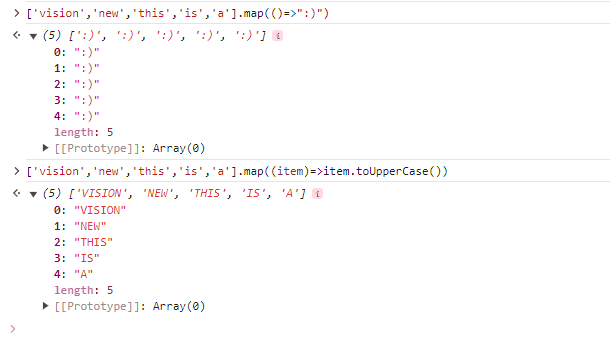
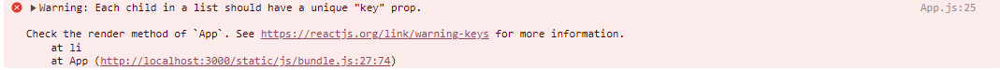

# to Do List

## onSubmit과 Array

```js
import { useState } from "react";

function App() {
  const [toDo, setToDo] = useState("");
  // toDo를 받을 수 있는 array
  // toDos를 바꾸기 위해서 직접적[push()]으로 변경해서는 X, setToDos 함수를 사용해야 한다.
  const [toDos, setToDos] = useState([]);
  const onChange = (event) => setToDo(event.target.value);
  const onSubmit = (event) => {
    event.preventDefault();
    if (toDo === "") {
      return;
    }
    setToDos((currentArray) => [toDo, ...currentArray]);
    setToDo("");
  };

  console.log(toDos);

  return (
    <div>
      <h1>My To Do ({toDos.length})</h1>
      <form onSubmit={onSubmit}>
        <input onChange={onChange} value={toDo} type="text" laceholder="Write your to do..." />
        <button>Add To Do</button>
      </form>
    </div>
  );
}

export default App;

```




<br>

## map을 사용한 list

```js
import { useState } from "react";

function App() {
  const [toDo, setToDo] = useState("");
  // toDo를 받을 수 있는 array
  // toDos를 바꾸기 위해서 직접적[push()]으로 변경해서는 X, setToDos 함수를 사용해야 한다.
  const [toDos, setToDos] = useState([]);
  const onChange = (event) => setToDo(event.target.value);
  const onSubmit = (event) => {
    event.preventDefault();
    if (toDo === "") {
      return;
    }
    setToDos((currentArray) => [toDo, ...currentArray]);
    setToDo("");
  };

  console.log(toDos);
  console.log(toDos.map((item, index) => <li key={index}>{item}</li>));

  return (
    <div>
      <h1>My To Do ({toDos.length})</h1>
      <form onSubmit={onSubmit}>
        <input onChange={onChange} value={toDo} type="text" laceholder="Write your to do..." />
        <button>Add To Do</button>
      </form>
      <hr />
      <ul>
        {
          /* map : 모든 array를 가져와서 변형 (새로운 array를 반환)*/
          toDos.map((item, index) => (
            <li key={index}>{item}</li>
          ))
        }
      </ul>
    </div>
  );
}

export default App;
```



